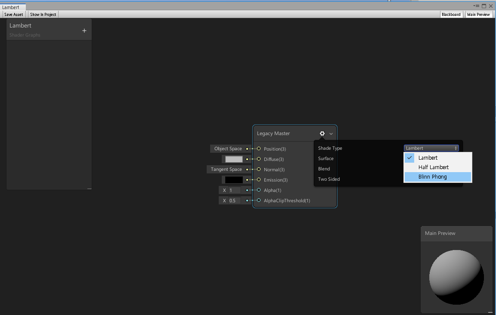
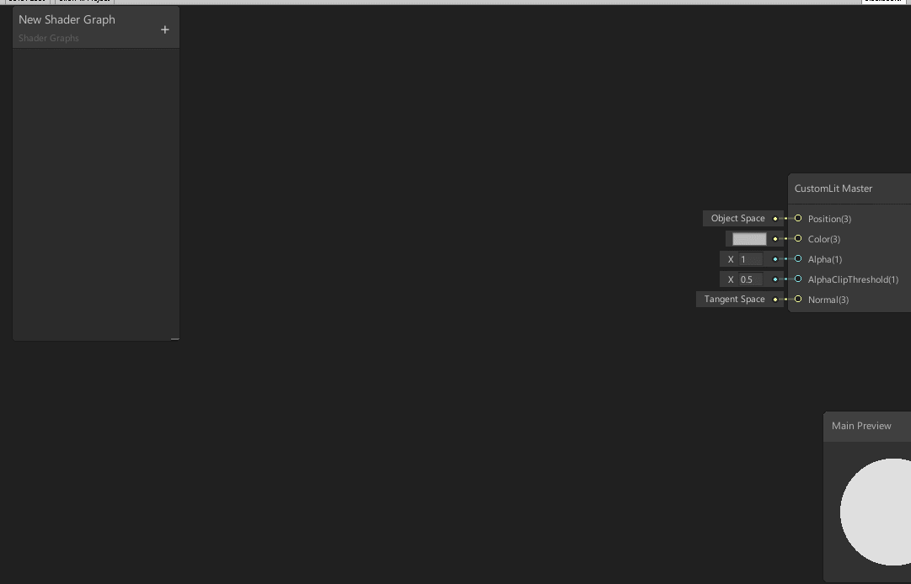
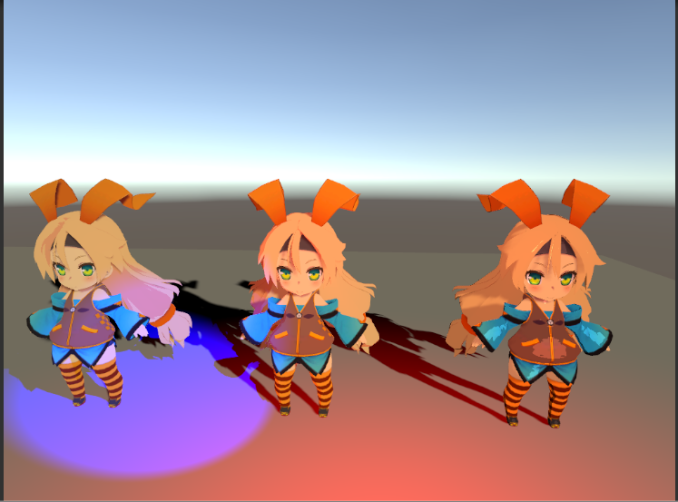

# CustomGraph

## 1. 환경

- Unity 2019.1
- LWRP 5.16
- SRP_Core 5.16
- ShaderGraph 5.16

## 2. CustomMasterNode

### 가. LegacyMasterNode

- BRDF가 아닌 Legacy 형태의 셰이딩

- Create - Shader - Hns17 - Legacy 메뉴를 통해 Legacy용 그래프를 생성

- MasterNode 속성의 ShaderType에서 원하는 Shading을 선택하고 저장

  

- Ref : https://hns17.tistory.com/entry/LWRP-Shader-Graph%EC%97%90-Custom-Master-Node-%EC%B6%94%EA%B0%80%ED%95%98%EA%B8%B0

### 나. CustomLitMasterNode

- Custom용 Master Node

- Create - Shader - Hns17 - CustomLit 메뉴를 통해 CustomLit용 그래프를 생성

- 속성창 옵션

  

  * Mode
    + Lit : Lighting과 관련된 셰이딩용 그래프
    + UnLit : Effect나 Outline 같은 Lighting과 관련없는 작업을 위한 노드
  * Cull : Cull Face State를 지정
  * DepthTest : DepthTest State를 지정

## 3. LightNode

- MainLightInfo : MainLight 정보를 가져옵니다.

  

  + Direction : 방향 정보
  + AtteColor : 감쇄가 적용된 색상 정보
  + Attenuatioin : 감쇄정보

  

- AdditionalLightInfo : AdditionalLight 정보를 가져옵니다.

  

  - Direction : 방향 정보
  - AtteColor : 감쇄가 적용된 색상 정보
  - Attenuatioin : 감쇄정보

  

- LightInfo : MainLight와 AdditionalLight 정보를 가져옵니다.

  

  - Normal : Normal 정보 입력
  - NdotLMainLight : MainLight의 NdotL 정보
  - AtteMainLight : MainLight의 광 감쇄 정보
  - NdotLAddLight : AdditionalLight의 NdotL 정보
  - AtteAddLight : AdditonalLight의 감쇄 정보
  - AtteColor : MainLight와  AdditonalLight 감쇄가 적용된 색상 정보
  
- Ref : https://www.youtube.com/watch?v=Fu6kAN7Sids

## 4. Sample

- Assets - SampleScene에 간단한 예제가 있습니다.

### 가. CustomNodeSample

- MasterGraph Sample

### 나. ToonSampleScene

- CustomLit MasterNode로 제작한 간단한 ToonGraph
- Ref : https://www.youtube.com/channel/UC5F69YiFSK7zVaNHeX78Qdw

### 다. ToonSampleScene2

- Sample용 ToonGraph
- Ref : https://hns17.tistory.com/category/Unity%20Engine/ShaderGraph

### 라. Outline

- ShaderGraph로 만든 Outline Sample
- VertexOutline, StencilOutline, Matcap Outline, Rim Outline
- Ref : https://www.youtube.com/watch?v=EOq5_8LojOk&feature=youtu.be

### 마. LightMap Test

- LightMap Test Sample Scene
- Ref : https://hns17.tistory.com/entry/LWRP%EC%97%90%EC%84%9C-Subtractive-%EB%AA%A8%EB%93%9C%EB%A1%9C-LightMap-Bake%ED%95%98%EA%B8%B0?category=708112